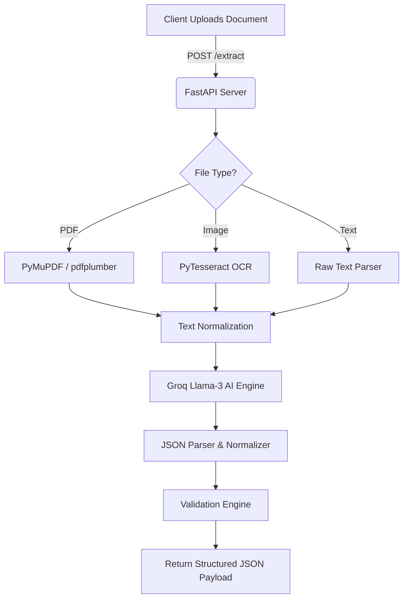

# DocuExtract AI


An enterprise-grade, AI-powered document data extractor that accurately structures information from invoices, receipts, and purchase orders into validated JSON payloads. 

## 📖 Project Overview
DocuExtract AI automates the tedious process of manual data entry by processing raw documents (PDFs, Scans, and Images), running OCR, and piping the extracted text into an advanced AI model (Groq). The system employs strict zero-hallucination prompts, data normalization, and mathematical validation to ensure high confidence and accuracy for downstream ERP integrations.

## 🏗️ Architecture Diagram


## ✨ Features
- **Multi-format Support:** Handles `.pdf`, `.png`, `.jpg`, `.txt`.
- **Zero Hallucination AI:** Strict prompt engineering ensures missing fields return `null` rather than synthetic data.
- **Data Normalization:** Automatically standardizes dates (`YYYY-MM-DD`), numbers (floats), and currency symbols.
- **Mathematical Validation:** Automatically verifies that `Quantity * Unit Price == Amount` and `Subtotal + Tax - Discount == Grand Total`.
- **Secure Handling:** UUID-based storage, strict MIME-type checking, and background cleanup of temporary uploads.

## 🛠️ Tech Stack
### Backend
- **Framework:** Python 3.12, FastAPI, Uvicorn
- **AI/LLM:** Groq API (OpenAI compatible client)
- **OCR/Parsers:** PyMuPDF, pdfplumber, pytesseract, Pillow
- **Validation:** Pydantic

### Frontend
- **Framework:** React + TypeScript + Vite
- **Styling:** Tailwind CSS
- **Network:** Axios

---

## 🚀 Installation & Setup

### Prerequisites
- Python 3.12+
- Node.js 18+
- [Tesseract OCR](https://github.com/tesseract-ocr/tesseract) installed and on `PATH`.

### Backend Setup
1. Navigate to the backend directory:
   ```bash
   cd backend
   ```
2. Create and activate a virtual environment:
   ```bash
   python -m venv venv
   # Windows:
   venv\Scripts\activate
   # macOS/Linux:
   source venv/bin/activate
   ```
3. Install dependencies:
   ```bash
   pip install -r requirements.txt
   ```
4. Configure Environment Variables:
   ```bash
   cp .env.example .env
   # Add your GROQ_API_KEY
   ```
5. Run the server:
   ```bash
   uvicorn app.main:app --reload
   ```

### Frontend Setup
1. Navigate to the frontend directory:
   ```bash
   cd frontend
   ```
2. Install dependencies:
   ```bash
   npm install
   ```
3. Start the dev server:
   ```bash
   npm run dev
   ```

---

## 🔌 API Documentation

### POST `/extract`
Accepts a `multipart/form-data` file upload and returns the extracted document data.

**Sample Request (cURL):**
```bash
curl -X POST "http://localhost:8000/extract" \
  -H "accept: application/json" \
  -H "Content-Type: multipart/form-data" \
  -F "file=@invoice.pdf"
```

**Sample Response:**
```json
{
  "success": true,
  "document": {
    "document_type": "invoice",
    "invoice_number": "INV-100",
    "vendor_name": "Acme Corp",
    "invoice_date": "2023-10-01",
    "subtotal": 500.00,
    "tax": 50.00,
    "discount": 0.00,
    "total": 550.00,
    "line_items": [
      {
        "description": "Widget A",
        "quantity": 5,
        "unit_price": 100.00,
        "amount": 500.00
      }
    ]
  },
  "validation": {
    "status": "PASS",
    "completeness": 95.0,
    "checks": [
      {
        "rule": "Grand Total Validation",
        "status": "PASS",
        "message": "Grand total math is correct."
      }
    ]
  }
}
```

---

## ⚠️ Known Limitations
- **OCR Quality Dependencies:** Poor quality scans (highly compressed or dark images) may yield insufficient text for the AI to process. The system safely halts extraction if fewer than 30 characters are detected.
- **Handwritten Documents:** Current OCR preprocessing is optimized for printed text. Handwritten receipts may have lower precision.

## 🔮 Future Improvements
- Integrate AWS Textract or Google Cloud Vision as an alternative to Tesseract for heavily degraded images.
- Implement webhook support for asynchronous bulk processing.
- Add user-feedback loops in the UI to correct and retrain extraction confidence.
